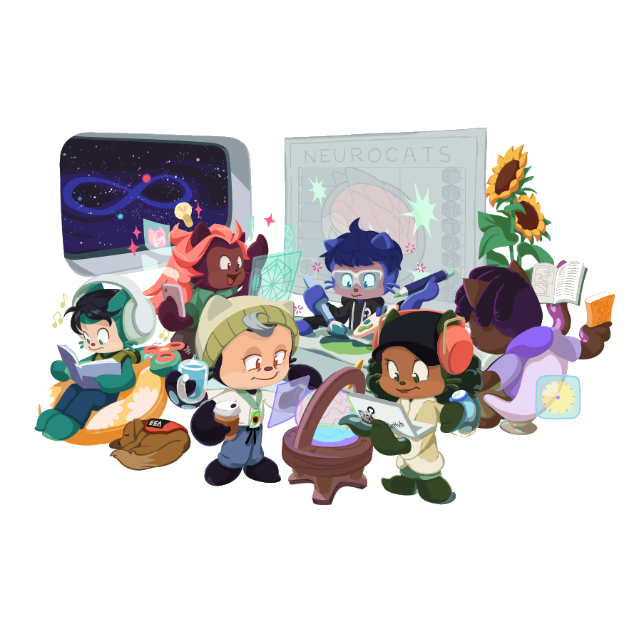

<p align="center">
  
</p>

# learning-playground

A structured learning system for AI coding agents. Uses motivated derivation, quiz gates,
and persistent progress tracking to build genuine understanding — not just surface-level
familiarity.

## What is this?

`/understand` is a skill that turns your AI assistant into a Socratic tutor. Instead of
dumping information, it:

1. **Probes** what you already know (binary search across knowledge strands)
2. **Plans** a motivated derivation path as a labeled DAG (directed acyclic graph)
3. **Teaches** one reasoning step per message, with quiz gates that block advancement
4. **Persists** everything to disk — progress survives session crashes, context compaction,
   and multi-day breaks

The methodology combines Vygotsky (zone of proximal development), Bloom (mastery gates),
Socratic method (generative probing), 3Blue1Brown-style motivated derivation, and
informational compression.

## Quick start

### Pi (recommended)

```bash
# Install the package
pi install git:github.com/jparrill/learning-playground

# Run setup (installs md-log and ask-user extensions)
/setup-learning-playground

# Start learning
/understand
```

### Claude Code

```bash
# Install as a plugin
claude plugin install github.com/jparrill/learning-playground

# Run setup (selects the Claude Code variant)
/setup-learning-playground

# Start learning
/understand
```

### Manual installation

Copy the skills and select your variant:

```bash
# Pi
cp -r skills/* ~/.pi/agent/skills/
cp skills/understand/variants/pi.md ~/.pi/agent/skills/understand/SKILL.md

# Claude Code
cp -r skills/* ~/.claude/skills/
cp skills/understand/variants/claude.md ~/.claude/skills/understand/SKILL.md

# Shared (both read from here)
cp -r skills/* ~/.agents/skills/
# Then copy the variant for your CLI:
cp skills/understand/variants/pi.md ~/.agents/skills/understand/SKILL.md    # Pi
cp skills/understand/variants/claude.md ~/.agents/skills/understand/SKILL.md # Claude Code
```

## Setup

Run `/setup-learning-playground` before your first session. It asks which CLI you use (Pi or
Claude Code) and copies the right skill variant:

- **Pi variant** — uses `md-log` for auto-logging and `ask-user` for structured probes
- **Claude Code variant** — manual Write/Edit logging with explicit quiz gate stops to prevent
  drift in long sessions

Without setup, the default `SKILL.md` includes both paths with conditional logic.

## How it works

When you run `/understand`, the skill:

1. **Asks for a workspace folder** — where all your learning notes will live
2. **Creates the domain structure** — folders for logs, references, and assets
3. **Sets up session logging** — activates `md-log` (Pi) or uses direct file writes (Claude)
4. **Asks what you want to learn** — then starts the probe phase

### The flow

```
/understand
  │
  ├─ "Where should I create the workspace?" → ~/learn/
  ├─ "What do you want to understand?" → "How LLM inference works"
  │
  ├─ Phase 1: Probe (locate your knowledge edge)
  │   └─ ~10 questions, binary search across strands
  │
  ├─ Phase 2: Plan (build the motivated DAG)
  │   └─ Written to _plan.md — survives session loss
  │
  ├─ Phase 3: Teach (one node per message)
  │   ├─ Tension → Motivated move → Definition → Anchor → Quiz
  │   └─ _map.md updated after EVERY quiz gate
  │
  └─ Session close (lightweight — everything already persisted)
```

### Workspace structure

```
~/learn/llm-inference/
  _map.md                          # what you understand (updated per quiz)
  _plan.md                         # the full DAG plan (nodes + status)
  logs/2026-08-24-foundations.md   # session transcript (open in Obsidian)
  reference/forward-pass.md        # compressed generators (shorter than log)
  assets/01-attention.svg          # visual aids
```

## Model recommendations

The quality of the learning experience depends heavily on the model used.

| Phase | Recommended | Acceptable | Not recommended |
|-------|-------------|------------|-----------------|
| **Probe + Plan** (Phase 1-2) | Frontier: Claude Opus, GPT-4o, Qwen3-235B | Strong mid-tier: Claude Sonnet, Qwen3-30B Q8 | Small/local < 14B |
| **Teach** (Phase 3) | Frontier (best experience) | Mid-tier (works for well-planned sessions) | Small with caveats |

**Why frontier models matter for planning:**
The probe and DAG plan are the foundation of everything. A weak probe misplaces the
knowledge edge. A weak plan produces unmotivated steps. Both compound through the entire
teaching phase. Invest the best model here — it runs once per domain.

**Using Pi with model routing:**
If you have [`skill-model-router`](https://github.com/jparrill/skill-model-router) installed,
configure it to auto-switch to your best model:

```json
// ~/.pi/agent/skill-models.json
{
  "understand": "anthropic-vertex/claude-opus-4-6"
}
```

## Crash safety

Sessions crash. Context gets compacted. Users close terminals mid-lesson. This skill is
designed for all of that:

- `_plan.md` is written as soon as the DAG is finalized (Phase 2)
- `_map.md` is updated after **every quiz gate** (not at session close)
- The next session reads both files and resumes from exactly the right node
- **Nothing is ever overwritten** — files are read-then-updated, never rewritten from scratch

## The methodology

Not a named academic technique. A synthetic system combining:

- **Zone of Proximal Development (Vygotsky)** — teach at the edge of what the learner knows
- **Mastery-based learning (Bloom)** — quiz gates block advancement until understanding is verified
- **Socratic method** — generative probing (free-text answers, not multiple choice in teaching)
- **Motivated derivation (3Blue1Brown)** — every fact is motivated by a problem, never arbitrary
- **Compression as understanding** — understanding = fewer generators reproducing the same knowledge

Original contributions:
- **Brain A vs Brain B** — distinguishing memorization from structural understanding
- **Strand bisection** — binary search to locate the knowledge edge efficiently
- **Step contract** — Tension → Move → Definition → Anchor → Reframe → Quiz (rigid per node)
- **Compression test** — reference notes must be shorter than the log, or no compression happened

See [DOCTRINE.md](skills/understand/DOCTRINE.md) for the full learning philosophy.

## Files

```
skills/
  understand/
    SKILL.md       # Main skill (default with conditionals, works without setup)
    DOCTRINE.md    # The 7 learning rules (read this to understand the philosophy)
    PROBE.md       # Phase 1 protocol — locating the knowledge edge
    PLAN.md        # Phase 2 protocol — building the motivated DAG
    TEACH.md       # Phase 3 protocol — the step contract and quiz gates
    FORMATS.md     # File schemas for _map.md, _plan.md, logs, references
    variants/
      pi.md        # Clean Pi variant (md-log + ask-user, no conditionals)
      claude.md    # Clean Claude Code variant (manual logging, explicit stops)
  setup-learning-playground/
    SKILL.md       # Environment setup — asks CLI, copies the right variant
examples/
  ai-concepts/     # Example domain with _map.md and _plan.md from a real session
```

## Acknowledgments

- **[pi-md-log](https://github.com/kanker2/pi-md-log)** by [@kanker2](https://github.com/kanker2) — session logging extension for Pi that powers the live note-taking in `/understand`. The `/setup-learning-playground` skill installs it automatically.
- **[pi-ask-user](https://github.com/kanker2/pi-ask-user)** by [@kanker2](https://github.com/kanker2) — structured questionnaire extension used during the probe phase.

## License

MIT
