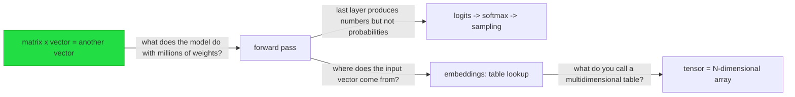

# Understanding map — LLM inference

## Locked
Solid ground. Safe to build on without re-testing.

- matrix x vector transforms one vector into another — probe q3 correct — 2026-08-21
- FP32/FP16 = more/fewer bits = more/less precision — probe q4 correct — 2026-08-21
- quantize = reduce bits per weight, not the operations — probe q5 correct — 2026-08-21
- KV cache stores keys and values from attention to avoid recalculation — probe q7 correct — 2026-08-21
- speculative decoding: small model proposes, large verifies in parallel — probe q9 correct — 2026-08-21
- forward pass = multiply vector by weight matrices layer by layer — quiz gate passed — 2026-08-21
- logits -> softmax -> probabilities -> sampling — quiz gate passed — 2026-08-21
- embedding = table lookup, not a calculation — quiz gate passed — 2026-08-21
- tensor = multidimensional array (vector=1D, matrix=2D) — quiz gate passed — 2026-08-23

## Shaky
Held, but not reliably. Repair on the way past; do not root a plan here.

- attention Q/K/V mechanism: knows they exist but not how they interact — probe q8 — 2026-08-21

## Unknown
Not yet reached. Not evidence of difficulty, only of order.

- quant naming scheme (Q4_K_M, Q8_0)
- MTP vs external draft model
- KV cache sizing (bytes per token)
- importance matrix
- GGUF structure
- safetensors vs GGUF
- memory estimation
- sampling params (temperature, top-p, top-k)
- scaling laws (loss vs compute/data/params)
- chinchilla scaling (compute-optimal ratio)
- emergent abilities and phase transitions
- MoE scaling (sparse vs dense at same compute)

## Conventions
Genuinely arbitrary. Never derived. Queued for spaced repetition.

(none yet)

## Structure

## Next frontier
- resume at: N5 — attention: query searches, key responds, value contributes (quiz gate pending)
