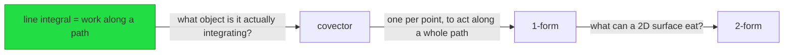
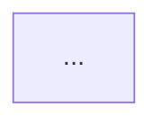
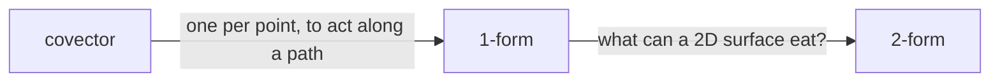

# File formats

All paths below are relative to the workspace path chosen in Phase 0.

```
<domain>/
  _map.md
  _plan.md
  logs/YYYY-MM-DD-<topic>.md
  reference/<concept>.md
  assets/<nn>-<slug>.svg
```

`<domain>` is a stable kebab-case field name — `AIConcepts`, `rust-ownership`,
`chess`. Never the session topic. Reuse an existing domain folder whenever the topic fits.

---

## `_map.md` — the understanding model

One per domain. Updated **incrementally after every quiz gate** — never deferred to session
close. This is the file that makes every session after the first one short, so it must never
be left stale.

**Never rewrite from scratch.** Read the file, update the specific node that changed, write
it back. If the session dies mid-write, the file should still be valid (worst case: one node
behind).

Every item carries **claim — evidence — date**. Evidence is one of:
`probe qN correct` · `probe qN wrong` · `answered don't know` · `inferred-locked from qN` ·
`self-reported, untested` · `taught <date>` · `quiz gate passed` · `user asserted`

```markdown
---
domain: differential-geometry
updated: 2026-08-21
sessions: 1
tags: [learning, understand]
---

# Understanding map — differential geometry

## Locked
Solid ground. Safe to build on without re-testing.

- line integral computes work done along a path — probe q3 correct — 2026-08-21
- divergence is outward flux per unit volume — probe q4 correct — 2026-08-21
- dot product as projection — inferred-locked from q3 — 2026-08-21
- covector = linear map from vectors to numbers — quiz gate passed — 2026-08-21

## Shaky
Held, but not reliably. Repair on the way past; do not root a plan here.

- E and B mix under a boost — answered don't know, taught in session — 2026-08-21

## Unknown
Not yet reached. Not evidence of difficulty, only of order.

- generalized Stokes
- pullback
- exterior derivative

## Conventions
Genuinely arbitrary. Never derived. Queued for spaced repetition.

- wedge symbol ordering convention — 2026-08-21

## Structure
Accumulates across every session in this domain. Edge labels are the motivations actually
taught — this graph is the picture of the understanding, not a syllabus.



## Next frontier
- resume at: wedge product — construction from antisymmetrisation
```

---

## `_plan.md` — the DAG plan

One per domain. Written in Phase 2 as soon as the DAG is finalized. Updated after every quiz
gate. This is the file that makes session resumption work — it tells the next session exactly
which nodes exist, their order, and which are done.

**Never overwrite from scratch.** Read the file first, then update the specific node that
changed. If the plan is restructured (node split, reorder), update in place.

Every node carries **id — label — type — status — motivation (edge label)**.

```markdown
---
domain: llm-inference
goal: "Decidir con criterio propio qué modelo bajar, qué quant elegir y qué flags usar"
updated: 2026-08-23
tags: [learning, understand, plan]
---

# Plan — LLM inference foundations

## Roots
- R1: matriz×vector transforma un vector en otro — user already holds
- R2: FP32/FP16 = más/menos bits = más/menos precisión — user already holds
- R3: quantizar = reducir bits por peso — user already holds

## Nodes

| ID | Label | Type | Status | Edge from | Motivation |
|----|-------|------|--------|-----------|------------|
| N1 | forward pass: matriz×vector capa a capa | derive | complete | R1 | un modelo tiene millones de pesos — ¿qué hace con ellos? |
| N2 | logits → softmax → probabilidades → sampling | derive | complete | N1 | la última capa produce números pero no son probabilidades — ¿qué falta? |
| N3 | embeddings: token → vector | derive | complete | N1 | el vector de entrada — ¿de dónde sale? |
| N4 | tensor = array multidimensional | derive | complete | N3 | ¿qué nombre tiene una tabla multidimensional de números? |
| N5 | atención: query busca, key responde, value aporta | derive | in-progress | N1, R4 | entre las capas lineales hay algo que añade inteligencia — ¿qué? |
| N6 | KV cache sizing: bytes por token | derive | pending | N5 | el cache crece por token — ¿cuánta memoria consume? |
| N7 | cómo quantiza: escala + offset por bloque | derive | pending | R2, R3 | si 16 bits ya funciona — ¿por qué no bajar a 4? |
| N8 | importance matrix: qué pesos importan más | derive | pending | N7 | no todos los pesos toleran igual la pérdida |
| N9 | GGUF: estructura, metadatos, tensores | derive | pending | N7 | el modelo quantizado — ¿en qué archivo se guarda? |
| N10 | safetensors vs GGUF: casos de uso | derive | pending | N9 | ¿y safetensors? ¿por qué dos formatos? |
| N11 | memory estimation: modelo + KV cache + drafters | derive | pending | N6 | el KV cache domina la RAM — ¿cómo estimar si caben 2 modelos? |
| N12 | MTP: cabezas de predicción dentro del propio modelo | derive | pending | R5 | el draft model es otro archivo — ¿se puede evitar esa dependencia? |
| N13 | DFlash: drafter propietario vs MTP integrado | derive | pending | N12 | DFlash es otro tipo de drafter — ¿qué hace diferente? |
| N14 | por qué la verificación es paralelizable | derive | pending | N12 | verificar N tokens a la vez es más rápido — ¿por qué? |
| N15 | sampling params: temperature, top-p, top-k | derive | pending | N2 | temperature, top-p, top-k — ¿qué controlan exactamente? |
| N16 | práctico: explorar código de un modelo real | derive | pending | N1, N4, N7 | quiero ver cómo es por dentro y tocar cosas |

## Session boundary
Realistic for one session: N1–N5. Rest in subsequent sessions.

## Structure (mermaid)

(copy of the mermaid graph from the log — kept here for redundancy)
```

**Status values:** `pending` | `in-progress` | `complete` | `skipped`

---

## `logs/YYYY-MM-DD-<topic>.md` — live session log

Append-only, written **as the session happens**. This is the user's reading surface: LaTeX,
mermaid, callouts and embedded SVG render here and cannot render in a terminal. Print its
path at the start of the session.

### Callout vocabulary

Each part of the step contract has one fixed callout type. Never improvise a mapping — the
colours are how the user navigates the note.

| Part | Callout |
|---|---|
| session goal | `> [!tldr] Goal` |
| whole probe transcript | `> [!example]- Probe — <n> questions` (collapsed) |
| verifier outcome | `> [!info] Verification` |
| tension | `> [!failure] Tension` |
| motivated move | **prose, not boxed** |
| the object | `> [!abstract] Definition` |
| anchor | `> [!important] Anchor` |
| reframe | `> [!note] Reframe` |
| quiz question | `> [!question] Quiz` |
| grade | `> [!success] Quiz — correct` / `> [!failure] Quiz — missed` |
| visual pending | `> [!warning] visual pending — <concept>` |
| user's own compression | `> [!quote] Your compression` |
| your compression | `> [!summary] Reconciled` |

**Box discipline.** At most ~3 callouts per node, prose in between. The motivated move is
deliberately unboxed: it is the argument, and it should read as continuous reasoning.

**Mermaid stays outside callouts** — it does not reliably render inside one. Math does, in
both `$…$` and `$$…$$`.

```markdown
---
domain: differential-geometry
topic: introduction to differential forms
date: 2026-08-21
goal: express Maxwell's equations in two equations using forms
status: in-progress
tags: [learning, understand, session-log]
---

# Understanding differential forms

> [!tldr] Goal
> <the user's own words, verbatim from Phase 0>

## Probe

> [!example]- Probe — 12 questions, edge located
> **Self-report.** <verbatim>
>
> **q1** A force field acts on a particle moving along a curve $C$. What does the line
> integral compute? → *net work done by the field* — correct
> **q2** …

**Edge located.** Vector calculus solid, differential-forms language absent.
**Roots.** line integral as work; divergence as flux density.

## Plan



> [!info] Verification
> Formal domain — internal-consistency pass, no contradictions.

## Teaching

### Node 1 — covectors

> [!failure] Tension
> We have something that eats one vector and returns a number. But a surface has two
> directions, and nothing we hold can take two vectors at once.

So try the cheapest possible extension: a machine that eats two vectors and is linear in
each. <the motivated move, in prose>

> [!abstract] Definition
> A covector on $V$ is a linear map $\alpha: V \to \mathbb{R}$.

> [!important] Anchor
> A $k$-form is the kind of thing a $k$-dimensional surface can eat.

> [!note] Reframe
> $dx$ was never an infinitesimal. It is the covector that reads off the $x$-component of
> whatever vector you feed it.

> [!question] Quiz
> $\alpha = 3\,dx - 2\,dy$ and $v = (2,5)$. What is $\alpha(v)$, and why did you not need a
> metric to compute it?

> [!success] Quiz — correct
> **Answer.** $-4$ — "the form already carries the coefficients"
> **Reasoning.** sound; did not reach for a dot product.

## Next frontier
resume at: wedge product — construction from antisymmetrisation
```

---

## `reference/<concept>.md` — the compressed artifact

Written and updated at compression checkpoints. **Must be shorter than the log.** If it is
not, no compression happened.

No narration, no teaching voice, no transcript. This is the file that gets reopened.

```markdown
---
domain: differential-geometry
concept: forms as things surfaces eat
updated: 2026-08-21
generators: 3
tags: [learning, understand, reference]
---

# Forms as things surfaces eat

## Generators
The whole strand regenerates from these.

1. A covector is a linear map from vectors to numbers.
2. A `k`-form is the kind of thing a `k`-dimensional surface can eat.
3. Integration over a `k`-dimensional region is integration of a `k`-form.

## Edges


## Anchors
- $dx$ is not an infinitesimal — it is the covector reading off the $x$-component.
- All integration over a 1-dimensional thing is integration of a 1-form.

## Conventions
- wedge ordering — a choice, not a consequence

## Sources
- <citation> — only when the verification produced them
```
