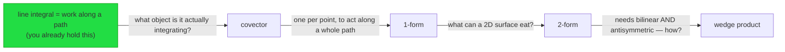

# Phase 2 — Plan

**Purpose.** Reason out the entire path from the user's measured edge to the goal, *before*
teaching anything. The DAG you emit is not decoration — it is the commitment that stops you
winging the arc mid-lesson, and it is literally the edge structure that doctrine rule 3 calls
understanding.

## Step 1 — Verify claims

Classify the domain:

**Formal domains** — mathematics, logic, type theory, pure algorithms. Ask for an
**internal-consistency pass**: are the claims mutually consistent, are the definitions
actually definitions rather than property lists, does each stated derivation follow.

**Empirical or fast-moving domains** — libraries, APIs, language semantics, hardware,
physics constants, standards, history. Parametric memory is not acceptable here. Verify
via web search and cite sources.

Mixed topics get both, scoped per claim.

## Step 2 — Choose the roots

**Roots are the unconditional truths the user already accepts** (doctrine rule 1), taken from
the probe and the map. Not generic axioms of the field, and not where a textbook would start.

A root must be something they can accept with no caveats: a universal statement, or a real
definition. If a candidate root still feels conditional to them, it is not a root — descend
until you find one that is.

## Step 3 — Build the DAG

**Nodes.** One reasoning step each. Sized to working memory — if a node needs two new objects
to make sense, it is two nodes. A node that cannot be quizzed in one question is too big.

**Edges carry motivations.** This is the part that matters. Each edge is labelled with the
*problem at its tail that sends you to its head*: what the previous step cannot do. Not
"prerequisite of", not topic order.

Good: `covector --"one per point, so it can act along a whole path"--> 1-form`
Bad: `covector --> 1-form`

If you cannot state an edge's motivation, you do not yet understand the path and must not
start teaching it. Find the motivation or restructure.

**Tag every node.**

- `derive` — the object is the minimal answer to a real problem. Almost everything.
- `convention` — genuinely arbitrary: notation, naming, ordering conventions, historical
  accident. **Never fake-derive a convention** (doctrine rule 1). Tag it, teach it in one
  line as "this is a choice, not a consequence".

**Prefer reframes.** When a node recasts something the user already holds, mark it as a
reframe. These are the cheapest nodes in the plan: relabelling existing structure rather
than building new. Order the DAG to front-load them where possible.

**Depth.** Plan the whole path to the goal, but expect not to walk all of it in one session.
Mark a realistic session boundary. Do not shorten the plan to fit — shorten the walk.

## Step 4 — Emit, persist, and present

### 4a — Write `_plan.md` to disk

**This is mandatory and must happen before teaching begins.** Write the plan to
`<domain>/_plan.md` using the schema in [FORMATS.md](./FORMATS.md#_planmd--the-dag-plan).
Every node gets an explicit `status:` field (`pending`, `in-progress`, `complete`, `skipped`).
This file is what makes session resumption work — if the session dies after this point, the
next session reads `_plan.md` and knows exactly where to pick up.

### 4b — Write the mermaid graph into the live log

Write the mermaid graph into the live log, with edge labels intact:

Node labels use the plain-language phrase, not only the term. The graph is the first thing
the user sees in the note, and a graph of bare technical names is a graph of empty labels
(doctrine rule 7).

Mermaid goes into the log **unboxed** — it does not render reliably inside a callout.

### 4c — Present in chat

Then in chat, briefly:

- the roots, named as things they already hold
- the arc in one sentence
- where the session boundary is
- anything the verification flagged

Ask whether to prune. The user may already own a branch, or want a different order. Honour it
and update **both** the graph in the log **and** `_plan.md`.

## Step 5 — Verify, then start

Before the first teaching step:

- **Verification confirms** → proceed.
- **Verification contradicts a claim** → stop. Surface the contradiction in chat and in the
  log. Re-plan the affected node. **Never teach a contradicted claim.**
- **Verification incomplete** → start teaching only claims already cleared. If none are
  cleared, wait and say you are waiting.
